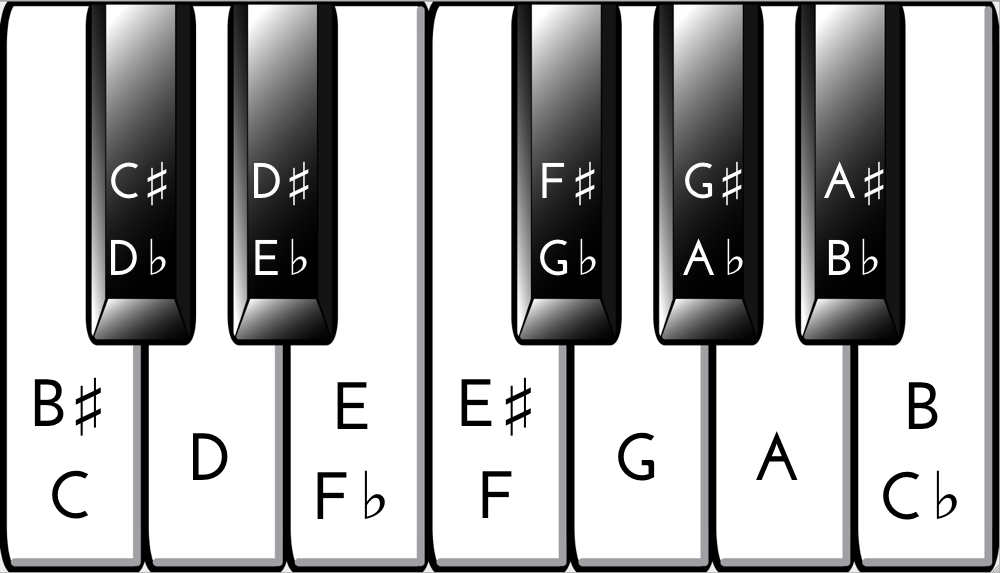

# libtfs

Copyright (C) 2017 Wang Renxin - https://github.com/paladin-t/libtsf

* Based on TinySoundFont, Copyright (C) 2017 Bernhard Schelling - https://github.com/schellingb/TinySoundFont
	* Based on SFZero, Copyright (C) 2012 Steve Folta - https://github.com/stevefolta/SFZero

## Overview

**libtfs** implements a software synthesizer using SoundFont2, and a player of Music Macro Language.

The library is a single C header file so it is extremely simple to integrate in your projects.

```c++
#define TSF_IMPLEMENTATION
#include "tsf.h"

...

tsf* ptsf = tsf_load_filename("soundfont.sf2");
tsf_set_output(ptsf, TSF_MONO, 44100, 0); // Sample rate.
tsf_note_on(ptsf, 0, 60, 1.0f); // Preset 0, middle C.
short half_second[22050]; // Synthesize 0.5 seconds.
tsf_render_short(ptsf, half_second, 22050, 0);
```

Play MML synchronously.

```c++
tsf_play(ptsf, 0, "ML L3 AA8G8E.D8C2P2 E.D8C<A8G8G2>P2 <G.A8G.A8>C.D8EG A.G8E8D8CD2", sleep);
```

Play MML asynchronously.

```c++
const char* seq = "ML L3 AA8G8E.D8C2P2 E.D8C<A8G8G2>P2 <G.A8G.A8>C.D8EG A.G8E8D8CD2";
tsf_play_async(ptsf, 0, seq, 0.2f);
while (seq && *seq) {
	seq = tsf_play_await(ptsf, 10.0f / 1000.0f);
	delay(10);
}
```

## Interface

The API documentation can be found on [top of the library source code](tsf.h).

There are also [examples available](examples) which come with a sample SoundFont file and build and play sound on Win32, Win64, Linux and MacOSX with no further dependencies.

## Documentation

[SoundFont](docs/SoundFont%20Technical%20Specification.pdf)

[Music Macro Language](https://en.wikipedia.org/wiki/Music_Macro_Language)

**MML syntax**

Use the precompiled PLAY binary in `/output/play.exe` to try with some MML sequences, as:

```bas
PLAY "[string expression]"
```

Used to play notes and a score. The tones are indicated by letters A through G. Accidentals are indicated with a "+" or "#" (for sharp) or "-" (for flat) immediately after the note letter. See this example:

```bas
PLAY "C C# C C#"
```

Whitespaces are ignored inside the string expression. There are also codes that set the duration, octave and tempo. They are all case-insensitive. PLAY executes the commands or notes the order in which they appear in the string. Any indicators that change the properties are effective for the notes following that indicator.

```
Ln     Sets the duration (length) of the notes. The variable n does not indicate an actual duration
       amount but rather a note type; L1 - whole note, L2 - half note, L4 - quarter note, etc.
       (L8, L16, L32, L64, ...). By default, n = 4.
       For triplets and quintets, use L3, L6, L12, ... and L5, L10, L20, ... series respectively.
       The shorthand notation of length is also provided for a note. For example, "L4 CDE L8 FG L4 AB"
       can be shortened to "L4 CDE F8G8 AB". F and G play as eighth notes while others play as quarter notes.
On     Sets the current octave. Valid values for n are 0 through 6. An octave begins with C and ends with B.
       Remember that C- is equivalent to B. 
< >    Changes the current octave respectively down or up one level.
Nn     Plays a specified note in the seven-octave range. Valid values are from 0 to 84. (0 is a pause.)
       Cannot use with sharp and flat. Cannot use with the shorthand notation neither.
MN     Stand for Music Normal. Note duration is 7/8ths of the length indicated by Ln. It is the default mode.
ML     Stand for Music Legato. Note duration is full length of that indicated by Ln.
MS     Stand for Music Staccato. Note duration is 3/4ths of the length indicated by Ln.
Pn     Causes a silence (pause) for the length of note indicated (same as Ln). 
Tn     Sets the number of "L4"s per minute (tempo). Valid values are from 32 to 255. The default value is T120. 
.      When placed after a note, it causes the duration of the note to be 3/2 of the set duration.
       This is how to get "dotted" notes. "L4 C#." would play C sharp as a dotted quarter note.
       It can be used for a pause as well.
```




## Dependencies

C standard libraries for `fopen`, `math`, `malloc` and `strtol` (can be removed by providing custom functions with `#define`s).

## License

**libtfs** is available under the [MIT license](https://choosealicense.com/licenses/mit/).
